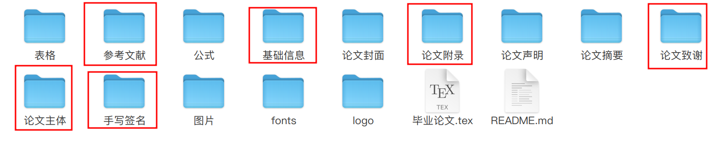

## GXMU Thesis

> GXMU Thesis is short for Guangxi Medical University Thesis LaTeX Template. Currently there is no English version provided.

## 广西医科大学毕业论文 LaTeX 模板

此模板旨在提供一种除 Word 模板之外简单易用的论文写作模板。考虑到作者对 LaTeX 尚在学习当中，该模板可能存在诸多瑕疵和不足之处，恳请诸位不吝指正。

编制过程中，在网路上查阅了大量文献资料，得到了非常多的帮助和指引，有力地推进了该模板的编写，在这里我诚挚地向互联网先辈们一一致谢，感谢你们的无私开源奉献。

#### 版权

**gxmu-logo-title** 图片来自**广西医科大学本科毕业论文（设计）内容要求格式规范及模板样例文件**，本项目未做任何修改。请注意：相关图形与文字均归**广西医科大学**所有，除用于此模板外，请勿用于任何其他用途。 

#### 演示文本

项目中示例内容均来自**央视网新闻**的部分截取，详情请查阅:[分子之心获数亿元A轮融资 将加快AI生物基础设施建设](https://opinion.cctv.com/2024/09/13/ARTIBJtW5D7Z6oYfhpQyAdLD240913.shtml?spm=C88965.P72990804435.S08478.10),[10.26万亿元、200亿元，利好积聚！“数”里行间透视中国经济活力](https://news.cctv.com/2025/06/05/ARTIak5G4TuHgmOXq2I89J5S250605.shtml)，在项目中相关文本段仅作为学习演示目的，未对原文内容进行修改。

#### 获取途径

1. 点击 右侧 **Github Release** 获取压缩包
2. 通过 `Git` 拉取源码

```bash
git clone https://github.com/hazukieq/gxmuthesis.git
```

3 通过 Overleaf/TexPage 进行线上编辑编译，由于现在Github导入是付费功能，故请下载压缩包后上传到Overleaf上。

- [Overleaf 分享链接](  https://www.overleaf.com/read/shmyqrqjvbrj#9dc02b)
- [TexPage 分享链接](https://www.texpage.com/share/93554ce214384667a8e03ce5ad556752)

**编译时务必选择 xelatex，若用pdflatex等则会出现编译失败的可能！！多数编辑器默认使用pdflatex等，需要提前变更为 xelatex 以支援中文**


#### 使用入门

1 下载压缩包者，请先解压，并记住相关位置；使用 `Git` 忽略该步骤


2 打开文件夹，你需要重点关注以下文件夹：基础信息，论文主题，参考文献，论文致谢，手写签名。



这里对以上文件夹做一个简要介绍：

**基础信息** 这里你需要填写个人的信息，包括第几届、学院专业年级导师姓名、论文摘要、自定义字体、引用包等。

**论文主体** 这里有三个文件：前言，论文，参考文献。由于参考文献是自动生成的，故不需要关注。若你不需要前言部分，则可以在**基础信息**文件设置。`论文文件` 是你写作中需要重要关注的地方，尤其当你的论文涉及到表格、图片、公式这类时，你需要花费些许时间调整以达到目的，相关示例存放在表格、公式、 图片三个文件夹中。若相关示例均无法满足时，推荐询问 AI 或者在浏览器上进行检索学习，关键词可以为`Latex 表格设置`...请注意，**你的图片务必要上传至图片文件夹**，引用时使用`图片/你的图片`。

**论文致谢** 这里填写致谢内容，不需要其他设置

**论文附录** 这里写附录内容，当涉及到复杂表格/量表时，可以查看附录中的量表示例，或者使用辅助性表格生成器进行设置。

**参考文献** 这里储存了你要引用的所有文献，由于其格式编写比较麻烦，推荐在文献网站导出文献时选择 `bib` 格式，然后将其复制到参考文献文件中即可！或者使用网路上使用相关BibTex文献生成器，这里推荐一个[网站](https://asouqi.github.io/bibtex-converter/)。

**手写签名** 这里存储你和导师的手写签名图片。手写签名可以在纸张上写后拍照转换。


3 按 **[基础信息.tex>论文.tex>参考文献.bib>致谢.tex>手写签名]** 步骤打开文件，并对内容进行修改。推荐每编辑一次，重新编译一次，确认相关改动是否符合。**⚠️注意：想要看到目录内容变更，需要编译两次！！！想要看到引用文献变更，请编译三次！！！**

4 编译完成后，在文件夹中会有**毕业论文.pdf**，请用阅读器打开查看效果。


#### 本地编译

- 先决条件：本地安装有 texlive，推荐安装 texlive2025

  同时，设置好 xelatex,bibtex,等的环境变量，确保终端或tex编辑器能够启用相关程序。

  [texlive介质下载推荐](https://mirrors.tuna.tsinghua.edu.cn/CTAN/systems/texlive/Images/texlive2025-20250308.iso)

- tex编辑器,如 texstudio等，或者notepad编辑后终端上编译也可

本地编译时，请只编译 **毕业论文.tex**(其会自动合并文件夹中的文件)，编译指令为:

```bash
xelatex 毕业论文.tex #请确认本地是否安装了 texlive
```


#### 参考资料

1 [一份（不太）简短的 LATEX 2ε 介绍](https://ctan.math.utah.edu/ctan/tex-archive/info/lshort/chinese/lshort-zh-cn.pdf)

2 [桂林电子科技大学毕业论文Latex模板](https://github.com/wrm244/GUEThsis/guet-thesis.cls)

3 [biblatex-gb7714-2015](https://github.com/hushidong/biblatex-gb7714-2015)

4 [请问如何将biblatex默认生成的那个References标题改为中文的?](https://www.zhihu.com/question/481540096)

5 [latex附录的图表标题改为图A1.图名](https://zhuanlan.zhihu.com/p/690183371)

6 [thuthesis](https://github.com/tuna/thuthesis)

7 [xstring](https://mirror.nyist.edu.cn/CTAN/macros/generic/xstring/xstring-en.pdf)

8 [tocloft](https://www.sys.kth.se/docs/texlive/texmf-dist/doc/latex/tocloft/tocloft.pdf)