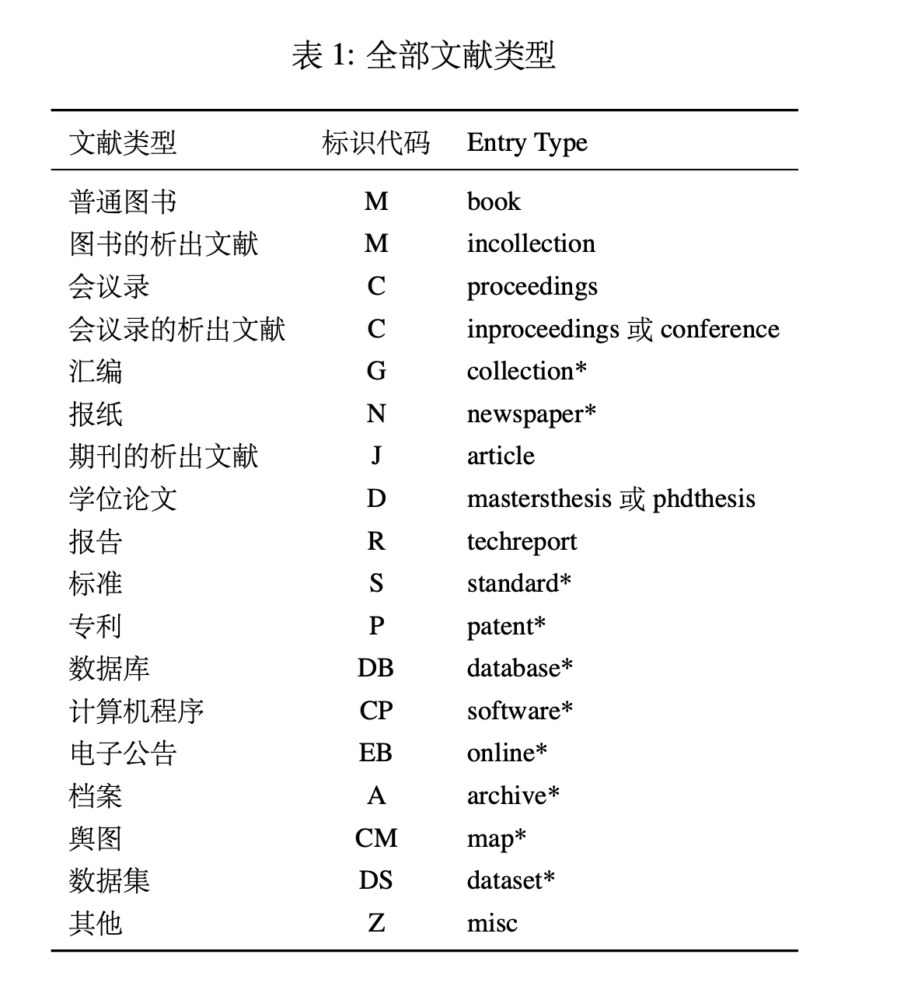

## 关于论文LaTeX的一些使用细节

#### Q1: 论文标题在哪里设置？

在基础信息里面的 `\theTitle`，英文标题则是 `\theTitleen`

#### Q2: 论文标题太长怎么办？

原则上 latex会自动换行，如果你觉得换行后上下间距太大，可以强制换行，并设置行间距:

```latex
你的标题你的标题你的标题你的标题
\\[-13pt] %这里就是强制换行，-13pt意味着减少行间距
你的标题你的标题你的标题你的标题
```

#### Q3：论文摘要在哪里设置？

在基础信息里面的 `\theCNAbs`，英文标题则是 `\theENAbs`。中英文关键词也是在这里设置的，中文请找 `\theCNAbsKeywords`，英文请找 `\theENAbsKeywords`

#### Q4: 论文正文里各级标题用什么设置的呢？

- 一级标题，请用 `\section`

- 二级标题，请用  `\subsection`

- 三级标题，请用  `\subsubsection`
- 四级标题，则有些特殊，请用 `\smallTitle{编号}{标题}`

#### Q5: 怎么引用文献呢？

请在 `参考文献引用.bib` 中填写，然后在 `论文.tex` 中使用 \cite{} 引用。

参考文献页它会自动生成，不需要自己编辑。

#### Q6: `参考文献引用.bib` 里面的内容看不懂，能否解释下呢？

大概常用的(学校文件提及)，就有如下：

| 引用类型      | 缩写  | 中文             |
| ------------- | ----- | ---------------- |
| @online       | EB/OL | 电子文献类       |
| @standard     | S     | 国际、国家标准类 |
| @patent       | P     | 专利类           |
| @thesis       | D     | 学位论文类       |
| @incollection | C     | 论文集类         |
| @book         | M     | 专著类           |
| @article      | J     | 期刊类           |

而一条文献条目结构长这样子：

```latex
@⟨引用类型⟩{⟨引用标记⟩,
⟨作者⟩ = {⟨文献作者名字⟩},
⟨日期⟩ = {⟨文献发表日期⟩},
...更多信息记录
}
```

我们在 `论文.tex`内容中引用时,就是\cite{引用标记}。引用标记相当一个花名(nickname)，只是方便你对各个文献进行区分、增加辨识度而已。引用标记之后的详细信息，就是要我们补充的，比如一条期刊文献必须的信息有：*作者名(Author)，刊名(Journal)，出版年份(Year,Month)，卷号(卷号)[Volume(Number)]，起止页码(pages)*，而与之对应的文本类，你可能比较熟悉：*作者.题名[J].刊名,出版年份,卷号(期号):起止页码.*

多数时候，我们无需自己手写 BIBTEX 文献条目。从 Google Scholar 或者期刊/数据库的网
站上都能够导出 BIBTEX 文献条目，老牌的文献管理软件 EndNote 也支持生成 BIBTEX 格式的数据库。开源软件 JabRef 甚至支持 BIBTEX 文献条目的导入、导出和管理。

当然，齐全的文献分类也是有的呢。



关于 `bibtex` 详情，见[技术文档](https://github.com/hushidong/biblatex-gb7714-2015/blob/master/biblatex-gb7714-2015.pdf)

#### Q7: 引号怎么打呢？

双引号是 \`\`''，单引号是`'

百分号是 \\%，波浪号是\\~{}，反斜杠(/)是\textbackslash

以及 \\$,\\%,\\&,\\{,\\},\\_=>\$,%,&,{,},\_

#### Q8: 怎么换行呢？

一般是空一行就就是换行。也可以手动换行，可以使用\\\,\newline 任意一个，但要注意换行不代表新的自然段开始，故你用`\\\\`或`\newline`时会发现缩进消失了。**新开一个自然段(也算换行)，请用 \par或者空一行**。

#### Q9: 空格怎么打？

正常打一个空格是没问题，但连续空格也会被识别为一个空格。

这时候需要用到其他手段：

一个斜杠+一个空格 `\ `，是一个小空格

\quad ，空格是大写字母 M的宽度，这个宽度也是1em

\qquad，空格是大写字母MM的宽度，即2em

\hspace{}，指定空格宽度，单位有 ex,em,pt,mm,cm

#### Q10: 进一步学习 LaTeX，或者处理排版上的问题，有啥推荐吗？

可以看一下[《不太简短的 LaTeX 教程》](http://mirrors.ctan.org/info/lshort/chinese/lshort-zh-cn.pdf)，或者把你的排版细节问题丢给 `ChatGPT`或`DeepSeek`。再者，就是把你的问题直接在浏览器上搜索。

 


