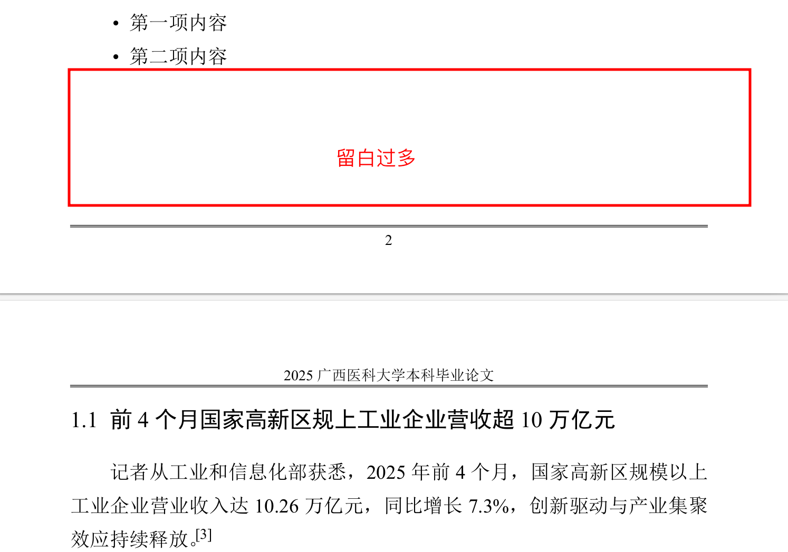
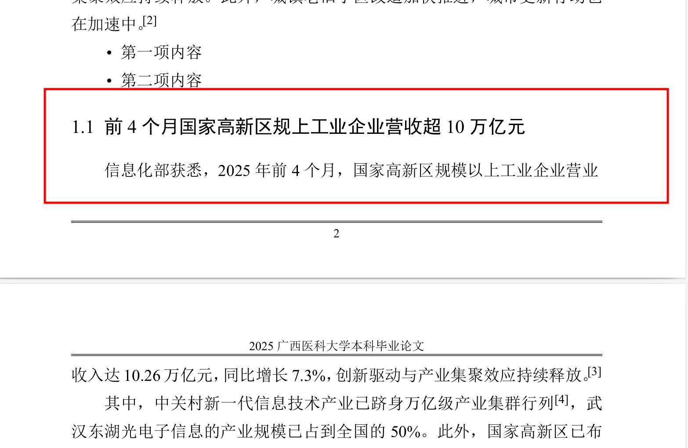

## 关于论文LaTeX的一些使用细节

#### Q0: 我想用终端编译，Makefile 脚本需要修改吗？

一般情况下， **xelatex,biber 的环境变量**设置了以后，这里是不需要修改的。

但未能识别的话，则需要改动：

请用记事本打开 Makefile 文件，修改 `TEX、Biber、FILENAME` 的值，注意 `xelatex、biber` 填写的是**完整路径**，`FILENAME` 即文件夹下的`毕业论文`，一般是不需要修改，但如果你把 `毕业论文.tex` 改为 `xxx.tex` 了，则请**务必修改 `FILENAME` 为 xxx!**

**用法：**

```makefile
Makefile 使用说明:
      make              编译 PDF 文件
      make all          等同于 'make'
      make toc          生成目录
      make bibs         生成参考文献
      make pdf          浏览 PDF 文件
      make clean        清理编译生成的临时文件
      make help         显示此帮助信息
```

#### Q1: 论文标题在哪里设置？

在 **基础信息.tex** 里面的 `\theTitle`，英文标题则是 `\theTitleen`

#### Q2: 论文标题太长怎么办？

原则上 latex会自动换行，如果你觉得换行后上下间距太大，可以强制换行，并设置行间距:

```latex
你的标题你的标题你的标题你的标题
\\[-13pt] %这里就是强制换行，-13pt意味着减少行间距
你的标题你的标题你的标题你的标题
```

#### Q3：论文摘要在哪里设置？

在基础信息里面的 `\theCNAbs`，英文标题则是 `\theENAbs`。中英文关键词也是在这里设置的，中文请找 `\theCNAbsKeywords`，英文请找 `\theENAbsKeywords`

#### Q4: 论文正文里各级标题用什么设置的呢？

- 一级标题，请用 `\section`

- 二级标题，请用  `\subsection`

- 三级标题，请用  `\subsubsection`
- 四级标题，则有些特殊，请用 `\smallTitle{编号}{标题}`
- 前言标题，请用 `\ftitle{标题}`；或者使用 `\front{前言内容}`
- 结语标题，请用`\etitle{标题}`
- 致谢部分，请用`\thanks{致谢正文}`
- 附录标题，请用 `\theAppend{标题}`

#### Q5: 怎么引用文献呢？

请在 `参考文献引用.bib` 中填写，然后在 `论文.tex` 中使用 \cite{} 引用。

参考文献页它会自动生成，不需要自己编辑。

#### Q6: `参考文献引用.bib` 里面的内容看不懂，能否解释下呢？

大概常用的(学校文件提及)，就有如下：

| 引用类型      | 缩写  | 中文             |
| ------------- | ----- | ---------------- |
| @online       | EB/OL | 电子文献类       |
| @standard     | S     | 国际、国家标准类 |
| @patent       | P     | 专利类           |
| @thesis       | D     | 学位论文类       |
| @incollection | C     | 论文集类         |
| @book         | M     | 专著类           |
| @article      | J     | 期刊类           |

而一条文献条目结构长这样子：

```latex
@⟨引用类型⟩{⟨引用标记⟩,
⟨作者⟩ = {⟨文献作者名字⟩},
⟨日期⟩ = {⟨文献发表日期⟩},
...更多信息记录
}
```

我们在 `论文.tex`内容中引用时,就是\cite{引用标记}。引用标记相当一个花名(nickname)，只是方便你对各个文献进行区分、增加辨识度而已。引用标记之后的详细信息，就是要我们补充的，比如一条期刊文献必须的信息有：*作者名(Author)，刊名(Journal)，出版年份(Year,Month)，卷号(期号)[Volume(Number)]，起止页码(pages)*，而与之对应的文本类，你可能比较熟悉：*作者.题名[J].刊名,出版年份,卷号(期号):起止页码.*

多数时候，我们无需自己手写 BIBTEX 文献条目。从 Google Scholar 或者期刊/数据库的网
站上都能够导出 BIBTEX 文献条目，老牌的文献管理软件 EndNote 也支持生成 BIBTEX 格式的数据库。开源软件 JabRef 甚至支持 BIBTEX 文献条目的导入、导出和管理。

当然，齐全的文献分类也是有的呢。


关于 `bibtex` 详情，见[技术文档](https://github.com/hushidong/biblatex-gb7714-2015/blob/master/biblatex-gb7714-2015.pdf)

#### Q7: 引号怎么打呢？

英文的双引号是 \`\`''，单引号是`'

中文的双引号是“”，单引号是‘’

波浪号: \textasciitilde

百分号是 \\%，波浪号是\\~{}，反斜杠(/)是\textbackslash

以及 \\$,\\%,\\&,\\{,\\},\\_=>\$,%,&,{,},\_

#### Q8: 怎么换行呢？

一般是空一行就就是换行。也可以手动换行，可以使用 `\\`,`\newline` 任意一个，但要注意换行不代表新的自然段开始，故你用`\\`或`\newline`时会发现缩进消失了。**新开一个自然段(也算换行)，请用 `\par`或者空一行**。

#### Q9: 空格怎么打？

正常打一个空格是没问题，但连续空格也会被识别为一个空格。

这时候需要用到其他手段：

一个斜杠+一个空格 `\ `，是一个小空格

\quad ，空格是大写字母 M的宽度，这个宽度也是1em

\qquad，空格是大写字母MM的宽度，即2em

\hspace{}，指定空格宽度，单位有 ex,em,pt,mm,cm

#### Q10: 进一步学习 LaTeX，或者处理排版上的问题，有啥推荐吗？

可以看一下[《不太简短的 LaTeX 教程》](http://mirrors.ctan.org/info/lshort/chinese/lshort-zh-cn.pdf)，或者把你的排版细节问题丢给 `ChatGPT`或`DeepSeek`。再者，就是把你的问题直接在浏览器上搜索。

#### Q11: 对于一些包，我想知道参数配置和使用示例，应该在哪里查询呢？

如果你在本地电脑上安装有 Tex 引擎的话，打开在终端(cmd, powershell, bash, zsh)，输入: `texdoc <包名>` 即可。

#### Q12: 有序、无序列表怎么用？

有序列表请用:

```tex
\arabic*.   阿拉伯数字: 1.
\chinese*、 汉字数字: 一、
\Roman*/\roman* 大写/小写罗马数字: II
\Alph*/\alph*.  字母数字: a.

\begin{pol}{编号格式}{缩进}
	\item 第一项
	\item 第二项
\emd{pol}

\begin{ol}
	\item 第一项
	\item 第二项
\emd{ol}
```

无序排序请用:

```tex
\begin{pul}{缩进}
	\item 第一项
	\item 第二项
\emd{pul}

\begin{ul}
	\item 第一项
	\item 第二项
\emd{ul}
```

#### Q13: 对齐方式怎么修改呢？就是内容的对齐，而不是内容与编号的对齐。

根据 `enumitem` 包，你可以调整 `leftmargin,labelindent, itemindent` 这几个值，但通常建议修改 `leftmargin` 即可。

#### Q14: 当自然段后面留白有点多，但生成排版时却因为后面标题，莫名其妙分页，如何强制不分页呢？

由于 LaTeX 断页会考虑避免孤行或者寡行，比如页面底部的标题下只有一行正文。上述问题刚好属于这种情况，因为不分页的话，就会出现页面底部只有一行正文。（摘自 [@zepinglee](https://ask.latexstudio.net/ask/question/3751.html))

当然，也是有办法让其强制不分页，即使用 `\pagebreak`(强制分页)，在你认为要分页的地方。比如：

```tex
\begin{pul}{2.5em}
	\item 第一项内容
	\item 第二项内容
	%\item 第一项内容 
\end{pul}

\subsection{前4个月国家高新区规上工业企业营收超10万亿元}
记者从工业和信息化部获悉，2025年前4个月，国家高新区规模以上工业企业营业收入达10.26万亿元，同比增长7.3\%，创新驱动与产业集聚效应持续释放。\cite{riley1990}
```

编译后：



比如觉得上方留白可以容纳一个标题和一行话，则将 `\pagebreak` 放到`企业营业`的后面，然后在人为切断的文字段前面空一行，且手动设置段落不缩进 `\noindent` 即

```tex
\begin{pul}{2.5em}
	\item 第一项内容
	\item 第二项内容
	%\item 第一项内容 
\end{pul}

\subsection{前4个月国家高新区规上工业企业营收超10万亿元}
记者从工业和信息化部获悉，2025年前4个月，国家高新区规模以上企业营业
\pagebreak

\noindent
收入达10.26万亿元，同比增长7.3\%，创新驱动与产业集聚效应持续释放。\cite{riley1990}
```

再次编译：



可以看到，我们实现了不分页、留白去除了。

**非常不建议表格、图片、列表等放在容破坏排版结构的地方（页面最底部，页面开头）**

